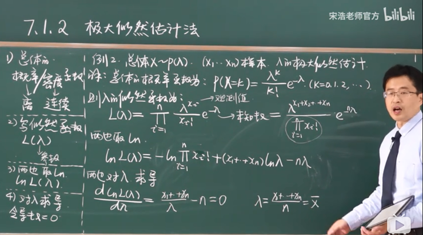
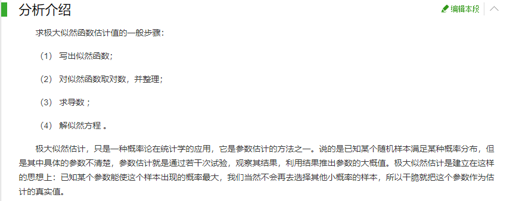

# Miao-A-SongHao-Probability-Theory-Notes

## P66 矩估计法
### 点估计

## P67 极大似然估计
### 解题步骤

- 1. 写出总体的概率/密度函数
- 2. 写似然函数`L(λ) = ∏(i=1~n) P(x_i)`
- 3. 两边取Ln
- 4. 对λ求导，令导数=0，求参数
### 理解

(注：图片截取自[360百科](https://baike.so.com/doc/6932153-7154476.html))
